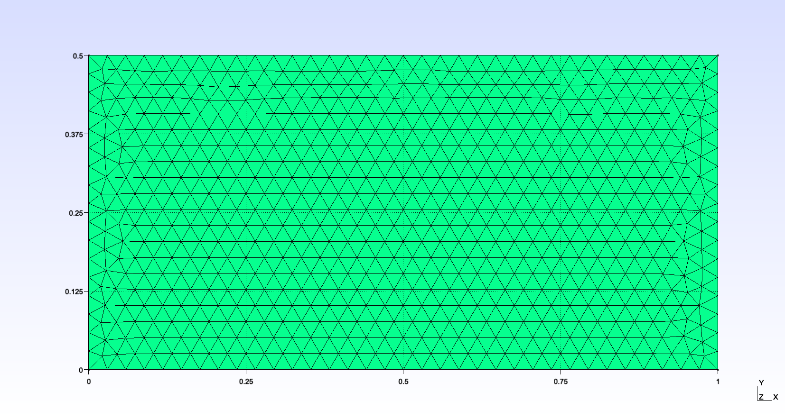
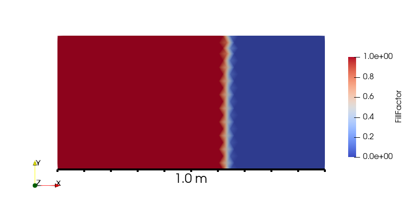

# Validation cases
We can identify some cases that have a reference solution (either analytical or established) and solve the same with Lizzy to compare results.

## Channel flow experiment
The channel flow experiment, as described in the well-known work by Weitzenbock, has an analytical solution. For a constant inlet pressure and a perfectly one-dimensional flow, the time of arrival of the flow front at a distance L from the inlet is expressed as:

$t = \frac{\phi \mu L^2}{2 \Delta p \mathbf{K}}$

### Case definition
To conduct the channel flow experiment, we will use the following values:
- $\phi$ = 0.5
- $\mu=0.1$ Pa$\cdot$s
- $\Delta p=$1.0E+05 Pa
- $\mathbf{K}$ = 1.0E-10 $\cdot I$ m$^2$

By plugging the values in Eq. (XXXX), and considering a distance L = 1m, we obtain a theoretical arrival time of: $t_{ref}$ = **2500s**. This shall be considered as the reference solution.

### Lizzy solution
The simulated scenario is the same as seen in [Channel flow experiment](./tutorials/rect.md) tutorial, with dimensions L = 1 m, W = 0.5 m

  
  

Running the simulation with increasing number of elements we obtain the following results:

| Number of elements | Fill time [s] | % Error |
|:-------------------|:-------------:|--------:|
| 16                 |    2530.1     |    1.20 |
| 64                 |    2510.5     |    0.42 |
| 256                |    2503.4     |    0.13 |
| 1024               |    2501.0     |    0.04 |
| 4096               |    2500.3     |    0.01 |

As the number of elements increases, the fill time of the part approaches the theoretical solution and the error decreases.

## Radial flow experiment
For this validation we simulate a radial infusion experiment with an isotropic material. The analytical solution for time of arrival of the flow front at a radial distance $R$ from the center is:

