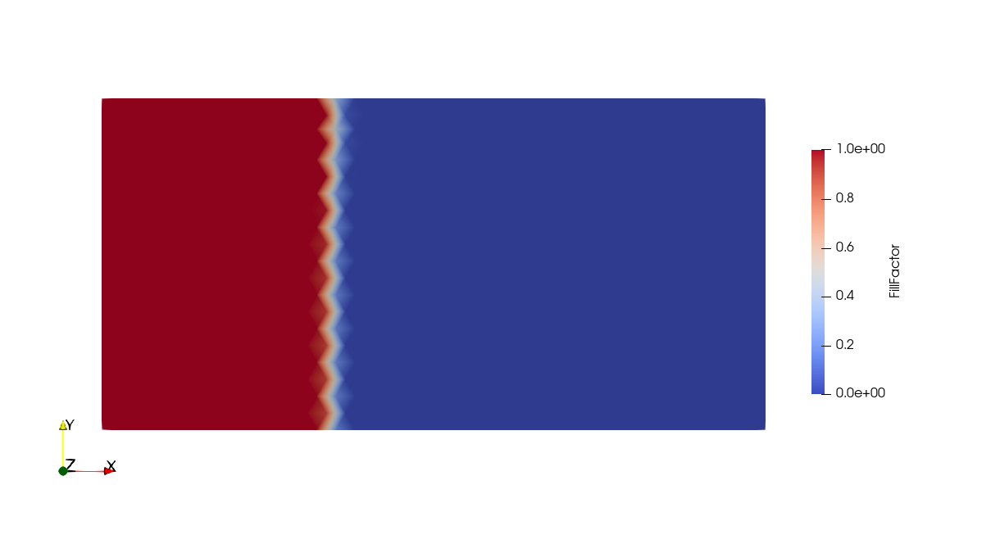

.. _channel_flow:

Channel Flow
============

This case demonstrates a minimal implementation of the solver. We will use Lizzy to simulate the filling of an isotropic rectangular panel, prescribing a one-dimensional flow. This classical infusion scenario is known as the Channel Flow experiment :cite:`weitzenbock1999`.

Copy the mesh file
------------------

The mesh file used in this example is available for :download:`download <../../../examples/meshes/Rect1M_R1.msh>`.
Create a new folder in a preferred location and name it something descriptive of the infusion scenarion, like *channel_flow* or similar. We will refer to this folder as the *working folder* and the entire Lizzy workflow will be run inside here.
Copy the mesh file into the working folder.

.. image:: ../../images/Rect1M_R1_mesh.jpg
   :width: 70%
   :align: center

The mesh contains 3 domain tags ("physical groups" in msh format):

* *left_edge*: line tag assigned to the left edge of the mesh
* *right_edge*: line tag assigned to the right edge of the mesh
* *domain*: elements tag assigned to all elements in the mesh

These tags will be used to identify regions of the mesh for assignment of material properties and boundary conditions.

Create the script file
----------------------

Create a new python script in the new directory "_channel_flow_". In this example, the file is named `channel_infusion.py`, but any name will do.
In the first line of the script, let's import Lizzy by:

.. code-block:: python

    import lizzy as liz

Import the mesh file
--------------------

Let's read the mesh file that we have copied by creating a ``Reader`` object:

.. code-block::

    mesh_reader = liz.Reader("Rect1M_R1.msh")

Make sure that the path given points to the mesh file that we have copied in the folder.
In this example, both the script and the mesh are in the working folder. If your folder structure is different, adjust the mesh path accordingly.

Defining material properties
----------------------------

Next, we need to define a few material and process properties. To do so, we use the ``ProcessParameters`` singleton:

.. code-block:: python

    liz.ProcessParameters.assign(mu=0.1, wo_delta_time=100)

Next, we can define the properties of the materials in the mesh. At the moment, material definition is handled in the script (in the future this will change). We can do so by creating a ``PorousMaterial`` and then using the ``add_material`` method of the ``MaterialManager`` singleton for each material that we want to add:

.. code-block:: python

    material = liz.PorousMaterial(1E-10, 1E-10, 1E-10, 0.5, 1.0)
    liz.MaterialManager.add_material('domain', material)

We use the class ``PorousMaterial`` to create a porous material associated to the material key. In absence of a proper documentation, the arguments of ``PorousMaterial`` are:

* ``k1`` (float): principal permeability value in local direction :math:`\mathbf{e}_1`
* ``k2`` (float): principal permeability value in local direction :math:`\mathbf{e}_2`
* ``k3`` (float): principal permeability value in local direction :math:`\mathbf{e}_3`
* ``porosity`` (float): the fraction of total material volume that is not occupied by solid material (1 - Vf)
* ``thickness`` (float): the thickness of the material.

Note that no material orientation was defined. This is ok because the material declared is isotropic. Behind the scenes, Lizzy assigns a global rosette aligned with the global x, y, z axes when no rosette is declared. Local material orientations and zone-specific rosettes will be detailed in more advanced examples.

.. note::

    Each material tag present in the mesh must be assigned a material, otherwise we will get an error: ``>>> Mesh contains unassigned material tag: domain``

Creating the simulation
-----------------------

Mesh
^^^^

Now that the mesh is read and properties are defined, we can instantiate a ``Mesh`` object and pass it our ``Reader``:

.. code-block:: python

    mesh = liz.Mesh(mesh_reader)

.. important::

    The mesh must be created **after** assigning materials and process conditions, otherwise these won't be applied and the simulation will run with default values or crash.

Boundary conditions
^^^^^^^^^^^^^^^^^^^

Next, we will create some boundary conditions. To do so, first we must instantiate a Boundary Conditions Manager (``BCManager``) object:

.. code-block::

    bc_manager = liz.BCManager()

At the moment, only inlets with assigned pressure are supported. Inlets are created by using the ``Inlet`` class and assigned to the ``BCManager`` using the ``add_inlet`` method:

.. code-block::

    inlet_1 = liz.Inlet('left_edge', 1E+05)
    bc_manager.add_inlet(inlet_1)

The ``Inlet`` class takes two arguments: the name of the physical line where it is assigned (``'left_edge'``) and the pressure value (``1E+05``).

Solve
-----

The next step is to create an appropriate solver and call `solve` to run the filling simulation:

.. code-block::

    solver = liz.Solver(mesh, bc_manager)
    solution = solver.solve(log="on")

Write results
-------------

The write-out of results is handled by the `Writer` object:

.. code-block::

    writer = liz.Writer(mesh)
    writer.save_results(solution, "Rect1M_R1")

The ``save_results`` method takes two arguments: the solution object returned by the solver and a string that specifies the name of the folder that will be created and where the results will be saved.

The full script
---------------

.. code-block::

    import lizzy as liz

    mesh_reader = liz.Reader("../meshes/Rect1M_R1.msh")

    liz.ProcessParameters.assign(mu=0.1, wo_delta_time=100)

    material = liz.PorousMaterial(1E-10, 1E-10, 1E-10, 0.5, 1.0)
    liz.MaterialManager.add_material('domain', material)

    mesh = liz.Mesh(mesh_reader)
    bc_manager = liz.BCManager()

    inlet_1 = liz.Inlet('left_edge', 1E+05)
    bc_manager.add_inlet(inlet_1)

    solver = liz.Solver(mesh, bc_manager, liz.SolverType.DIRECT_SPARSE)
    solution = solver.solve(log="on")

    writer = liz.Writer(mesh)
    writer.save_results(solution, "Rect1M_R1", save_cv_mesh=True)

Solution visualisation
----------------------

The results are saved in a folder ``results`` which is created in the current working directory of the interpreter. By default, Lizzy will save results in the ``XDMF`` format, leveraging HDF5 database in binary format to store the actual data.  Load the file ``Rect1M_R1_RES.xdmf`` into Paraview to visualise the results in a time series.
Lizzy will save the following fields: "FillFactor", "FreeSurface", "Pressure", "Velocity". In the picture, an example of fill factor at t=300s.

.. tip::

    The mesh of control volumes can be saved by adding the optional argument ``save_cv_mesh=True`` in the ``Writer.save_results()`` method. Doing so will also export a file ``Rect1M_R1_CV.vtk`` that can be loaded in Paraview and superimposed onto the results mesh:

    .. image:: ../../images/Rect1M_R1_CV.png
       :width: 60%
       :align: center

References
----------

.. bibliography:: ../refs.bib
   :style: unsrt