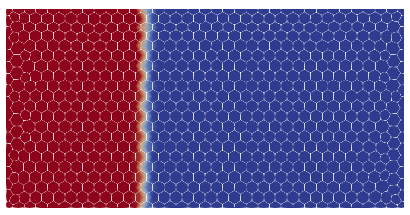

# Channel flow experiment
In this basic example we will simulate the filling of a rectangular panel. The mesh file used in this example is [`Rect1M_R1.msh`](../../examples/meshes/Rect1M_R1.msh).

## Copy the mesh file
Create a folder in a preferred location. In this example, we will create a folder named "_channel_flow_" for reference, but pick any name. We will refer to this folder as the "working folder".
Copy the file [`Rect1M_R1.msh`](../../examples/meshes/Rect1M_R1.msh) in the new directory "_channel_flow_".

<div style="display: flex; justify-content: center;">

</div>

The mesh contains 3 domain tags ("physical groups" in msh format):
- "left_edge": line tag assigned to the left edge of the mesh
- "right_edge": line tag assigned to the right edge of the mesh
- "domain": elements tag assigned to all elements in the mesh

These tags will be used to identify regions of the mesh for assignment of material properties and boundary conditions.

## Create the script file
Create a new python script in the new directory "_channel_flow_". In this example, the file is named `channel_infusion.py`, but any name will do.
In the first line of the script, let's import Lizzy by:
```
import lizzy as liz
```
### Import the mesh file
Let's read the mesh file that we have copied by creating a `Reader` object:
```
mesh_reader = liz.Reader("Rect1M_R1.msh")
```
Make sure that the path given points to the mesh file that we have copied in the folder.
In this example, both the script and the mesh are in the working folder. If your folder structure is different, adjust the mesh path accordingly.

### Defining material properties
Next, we need to define a few material and process properties. To do so, we use the `ProcessParameters` singleton:
```
liz.ProcessParameters.assign(mu=0.1, wo_delta_time=100)
```
Next, we can define the properties of the materials in the mesh. At the moment, material definition is handled in the script (in the future this will change). We can do so by creating a `PorousMaterial` and then using the `add_material` method of the `MaterialManager` singleton for each material that we want to add:
```
material = liz.PorousMaterial(1E-10, 1E-10, 1E-10, 0.5, 1.0)
liz.MaterialManager.add_material('domain', material)
```
We use the class `PorousMaterial` to create a porous material associated to the material key. In absence of a proper documentation, the arguments of `PorousMaterial` are:
- `k1` (float): principal permeability value in local direction **e**1.
- `k2` (float): principal permeability value in local direction **e**2.
- `k3` (float): principal permeability value in local direction **e**3.
- `porosity` (float): the fraction of total material volume that is not occupied by solid material (1 - Vf)
- `thickness` (float): the thickness of the material

Note that no orientation rosette was defined in this case. This is fine because the material declared is isotropic. Behind the scenes, Lizzy assigns a global rosette aligned with the global x, y, z axes when no rosette is declared. Local material orientations and zone-specific rosettes will be detailed in further examples.

**Important**: each material tag present in the mesh must be assigned a material, otherwise we will get an error:
`'Mesh contains unassigned material tag: domain'`

### Creating the simulation objects
Now that the mesh is read and properties are defined, we can instantiate a `Mesh` object:
```
mesh = liz.Mesh(mesh_reader)
```
**Important**: the mesh must be created **after** assigning materials and process conditions, otherwise these won't be applied and the simulation will run with default values or crash.

Next, we will create some boundary conditions. To do so, first we must instantiate a Boundary Conditions Manager (`BCManager`) object:
```
bc_manager = liz.BCManager()
```
At the moment, only inlets with assigned pressure are supported. Inlets are created by using the `Inlet` class and assigned to the `BCManager` using the `add_inlet` method:
```
inlet_1 = liz.Inlet('left_edge', 1E+05)
bc_manager.add_inlet(inlet_1)
```
The `Inlet` class takes two arguments: the name of the physical line where it is assigned (`'left_edge'`) and the pressure value (`1E+05`).

### Solve
The next step is to create an appropriate solver and call `solve` to run the filling simulation:
```
solver = liz.Solver(mesh, bc_manager)
solution = solver.solve(log="on")
```
### Write results
The write-out of results is handled by the `Writer` object:
```
writer = liz.Writer(mesh)
writer.save_results(solution, "Rect1M_R1")
```
The `save_results` method takes the `solution` returned by the solver, and one string argument (`"Rect1M_R1"`) that defines the name of the folder that will be created and where the results will be saved.

## The full script
```
import lizzy as liz

# read the mesh file: adjust path if needed
mesh_reader = liz.Reader("../meshes/Rect1M_R1.msh")

liz.ProcessParameters.assign(mu=0.1, wo_delta_time=100)

# add a material to each material tag present in the mesh
material = liz.PorousMaterial(1E-10, 1E-10, 1E-10, 0.5, 1.0)
liz.MaterialManager.add_material('domain', material)

# Create a mesh object and a boundary conditions manager
mesh = liz.Mesh(mesh_reader)
bc_manager = liz.BCManager()

# Create an Inlet (or more) and add it to the inlets group
inlet_1 = liz.Inlet('left_edge', 1E+04)
bc_manager.add_inlet(inlet_1)

# Instantiate a solver and solve
solver = liz.Solver(mesh, bc_manager, liz.SolverType.DIRECT_SPARSE)
solution = solver.solve(log="on")

# Create a write-out object and save results
writer = liz.Writer(mesh)
writer.save_results(solution, "Rect1M_R1", save_cv_mesh=True)
```

# Solution visualisation
The results are saved in a folder `results` which is created in the current working directory of the interpreter. By default, Lizzy will save results in the `XDMF` format, leveraging HDF5 database in binary format to store the actual data.  Load the file `Rect1M_R1_RES.xdmf` into Paraview to visualise the results in a time series.
Lizzy will save the following fields: "FillFactor", "FreeSurface", "Pressure", "Velocity". In the picture, an example of fill factor at t=300s.

<div style="display: flex; justify-content: center;">

</div>

### Pro tip:
The mesh of control volumes can be saved by adding the optional argument `writer.save_results(solution, "Rect1M_R1", save_cv_mesh=True)` in the `Writer.save_results()` method. Doing so will also export a file `Rect1M_R1_CV.vtk` that can be loaded in Paraview as a superimposed mesh:

<div style="display: flex; justify-content: center;">

</div>

